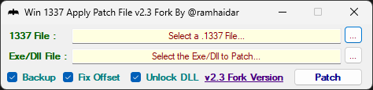

# Win_1337_Apply_Patch

Windows desktop utility for applying text-based `.1337` byte patches to `.exe` and `.dll` files. It provides a Windows Forms GUI for interactive use and a command-line mode for scripted patching.

> **Warning:** Patching executable files changes them in place and can make them unusable. Work on a copy where possible, enable backups before patching, and verify that the patch file belongs to the exact target binary. The application requests administrator privileges and should be used only with files you are authorized to modify.



## Overview

A `.1337` file identifies an expected target filename and one or more byte replacements. Win_1337_Apply_Patch validates the target name and expected bytes before writing the modified binary. Unless checksum normalization is skipped internally by a test request, the patch engine removes the PE certificate and recalculates the PE checksum after writing.

The project is a fork associated with [@ramhaidar](https://github.com/ramhaidar/Win_1337_Apply_Patch) and retains attribution to the original author, DeltaFoX (DeFconX).

## Features

- Apply `.1337` patches to Windows `.exe` and `.dll` files.
- Validate the patch header, target filename, offsets, hexadecimal bytes, and expected byte values before modifying the target.
- Create timestamped `.BAK` backups before patching.
- Optionally apply the `0xC00` file-offset adjustment used by the GUI and CLI.
- Remove PE certificates and recalculate the PE checksum after a successful write.
- Use a Windows Forms GUI with file dialogs, drag-and-drop patch selection, tooltips, and persisted checkbox settings.
- Automatically suggest known NVIDIA targets for `nvencodeapi.1337` and `nvencodeapi64.1337` when the expected files exist.
- Patch from the command line with success/error exit codes.
- Optionally update ownership and permissions for protected files through `takeown` and `icacls`.
- Schedule a patch through the current user's Windows `RunOnce` registry entry for execution after the next reboot.

## Tech Stack

- C# Windows Forms application.
- .NET Framework 4.8 (`net48`).
- Classic MSBuild-style application project: `Win_1337_Patch/Win_1337_Patch.csproj`.
- MSTest test project targeting .NET Framework 4.8.
- NuGet `PackageReference` dependencies, including `System.Resources.Extensions`, `System.Memory`, `System.Buffers`, `System.Numerics.Vectors`, and `System.Runtime.CompilerServices.Unsafe`.
- PE operations use `Imagehlp.dll`; protected-file ownership uses Windows `takeown` and `icacls` commands.

## Repository Structure

```text
Win_1337_Apply_Patch/
├── Win_1337_Apply_Patch.sln       # Application and test solution
├── Win_1337_Patch/
│   ├── 1337.cs                    # Windows Forms UI
│   ├── PatchEngine.cs              # Validation, byte patching, backup, PE normalization
│   ├── PatchTargetResolver.cs      # Known automatic target resolution
│   ├── Program.cs                  # GUI entry point and CLI parser/runner
│   ├── ScheduledPatchManager.cs    # Windows RunOnce scheduling
│   ├── mCheckSum.cs                # PE checksum calculation
│   ├── app.manifest               # Requests administrator execution
│   ├── app.config                  # .NET Framework startup/settings configuration
│   └── Properties/                # Assembly metadata, resources, and user settings
├── Win_1337_Patch.Tests/
│   ├── PatchEngineTests.cs
│   ├── ConsolePatchParserTests.cs
│   ├── PatchTargetResolverTests.cs
│   └── Win_1337_Patch.Tests.csproj
├── docs/screenshots/image.png      # GUI screenshot
├── LICENSE                          # GNU GPLv3 text
└── README.md
```

## Prerequisites

### Running the application

- Windows.
- .NET Framework 4.8, as required by the application and test projects.
- Administrator privileges. The application manifest requests `requireAdministrator`, including for normal GUI startup.
- A `.1337` patch file and the matching target `.exe` or `.dll`.

### Building and testing

- Visual Studio with .NET desktop development tools, **or** a compatible MSBuild/.NET SDK toolchain that can build .NET Framework 4.8 projects.
- Access to restore the NuGet `PackageReference` dependencies.
- A Windows environment for the Windows Forms and Windows API portions of the application.

## Setup

1. Clone the repository and enter its directory:

   ```powershell
   git clone https://github.com/ramhaidar/Win_1337_Apply_Patch.git
   Set-Location Win_1337_Apply_Patch
   ```

2. Restore dependencies:

   ```powershell
   dotnet restore .\Win_1337_Apply_Patch.sln
   ```

3. Build the solution in Release configuration:

   ```powershell
   dotnet build .\Win_1337_Apply_Patch.sln --configuration Release
   ```

   Alternatively, open `Win_1337_Apply_Patch.sln` in Visual Studio and build the `Release | Any CPU` solution configuration.

## Configuration

The application has no required environment variables or external service configuration.

The following user-scoped settings are defined in `Win_1337_Patch/Properties/Settings.settings` and default to `True`:

| Setting | Effect |
|---|---|
| `fixoffset` | Enables the `0xC00` file-offset adjustment by default. |
| `backup` | Enables timestamped target backups by default. |
| `changeOwnership` | Enables the ownership/permission option by default. |

GUI settings are persisted through the normal .NET user-settings mechanism. No secrets are stored in the repository. Do not commit target binaries, private patch files, or generated build output.

## Usage

### GUI

1. Launch the built `Win_1337_Patch.exe` as an administrator.
2. Select a `.1337` file, or drag it onto the patch-file area.
3. Select the target `.exe` or `.dll`. The application may auto-select a known NVIDIA target; otherwise use **Select EXE** to choose the file manually.
4. Review the options:
   - **Fix File Offset**: subtract `0xC00` from each patch offset before applying it.
   - **Create Backup**: create a timestamped `<target>.<timestamp>.BAK` copy before writing.
   - **Change Ownership**: run `takeown` and `icacls` for a protected target.
5. Click **Patch** and review the result message.

### Command line

The executable supports patch mode with this form:

```text
Win_1337_Patch.exe -patch <1337-file> <target-file> [options]
```

The executable is built as a Windows GUI application, so command-line mode allocates a console for output. The process returns exit code `0` on success and `1` on validation, scheduling, or patching failure.

#### Options

| Option | Description |
|---|---|
| `-patch`, `--patch` | Select command-line patch mode. |
| `-fileoffset`, `--fileoffset`, `-offset`, `--offset` | Apply the `0xC00` offset adjustment. |
| `-backup`, `--backup`, `-b` | Create a timestamped backup before patching. |
| `-takeownership`, `--takeownership`, `-take-ownership`, `--take-ownership` | Run `takeown` and `icacls` for the target. Requires administrator privileges. |
| `-schedule`, `--schedule`, `-runonce`, `--run-once`, `-run-on-reboot`, `--run-on-reboot` | Store the patch command in the current user's `RunOnce` registry key for the next boot. |
| `-help`, `--help`, `-h`, `/?`, `/help` | Display usage information. |

Examples:

```powershell
# Apply a patch
.\Win_1337_Patch.exe -patch .\patch.1337 .\target.dll

# Apply a patch and keep a backup
.\Win_1337_Patch.exe -patch .\patch.1337 .\target.dll -backup

# Apply a patch with the 0xC00 adjustment
.\Win_1337_Patch.exe -patch .\patch.1337 .\target.dll -fileoffset

# Patch a protected Windows file and keep a backup
.\Win_1337_Patch.exe -patch .\patch.1337 C:\Windows\System32\target.dll -takeownership -backup

# Schedule the patch for the next reboot
.\Win_1337_Patch.exe -patch .\patch.1337 .\target.dll -schedule -backup
```

The `-scheduledrun` / `--scheduled-run` switch is an internal marker added to commands created by the scheduler. It is not normally needed for manual invocation.

### Automatic target resolution

The GUI resolves these patch filenames, when the candidate target exists:

| Patch file | Suggested target |
|---|---|
| `nvencodeapi.1337` | `%WINDIR%\SysWOW64\nvEncodeAPI.dll` |
| `nvencodeapi64.1337` | `%WINDIR%\System32\nvEncodeAPI64.dll` |

Automatic resolution is limited to these names. Other patch files require manual target selection.

## `.1337` File Format

The patch engine expects a text file whose first line starts with `>` and whose remaining non-empty lines contain hexadecimal byte replacements:

```text
>target.exe
1A3F:90->EB
1A40:00->90
```

- The header is `>` followed by the expected target filename. The comparison uses the filename, not the full path, and is case-insensitive.
- Each patch entry is `offset:expected->replacement`.
- Offsets and bytes are hexadecimal.
- The expected byte must match the target at the computed offset; otherwise the patch fails before the target is written.
- With **Fix File Offset** enabled, the engine subtracts `0xC00` from every declared offset.
- Blank lines after the header are ignored.

## Architecture

- **`PatchEngine`** is shared by the GUI and CLI. It resolves paths, validates files and patch entries, checks expected bytes, optionally creates a backup, writes the modified bytes, removes the PE certificate, and recalculates the checksum.
- **`Program`** chooses CLI mode when `-patch`/`--patch` is present; otherwise it starts the Windows Forms application. `ConsolePatchParser` handles CLI switches and positional paths.
- **`PatchTargetResolver`** contains the known NVIDIA filename-to-target mappings used by the GUI.
- **`ScheduledPatchManager`** validates the paths and writes a generated command to `HKCU\SOFTWARE\Microsoft\Windows\CurrentVersion\RunOnce`. The command runs the application with `-scheduledrun` after the next login/reboot cycle.
- **`mCheckSum`** performs PE checksum recalculation after patching.

## Common Commands

Run these from the repository root in PowerShell:

| Task | Command | Status |
|---|---|---|
| Restore | `dotnet restore .\Win_1337_Apply_Patch.sln` | Supported by the solution's PackageReference projects |
| Build Debug | `dotnet build .\Win_1337_Apply_Patch.sln --configuration Debug` | Supported |
| Build Release | `dotnet build .\Win_1337_Apply_Patch.sln --configuration Release` | Supported |
| Run all tests | `dotnet test .\Win_1337_Patch.Tests\Win_1337_Patch.Tests.csproj` | Supported |
| Run focused tests | `dotnet test .\Win_1337_Patch.Tests\Win_1337_Patch.Tests.csproj --filter "FullyQualifiedName~PatchEngineTests"` | Supported by the MSTest test runner |
| Lint | — | No lint command/configuration was found in the repository |
| Format | — | No formatter command/configuration was found in the repository |
| Typecheck | — | No separate typecheck command was found; compilation is the available C# check |

Visual Studio users can run the full suite through **Test > Run All Tests**.

## Testing

Tests are in `Win_1337_Patch.Tests` and use MSTest (`Microsoft.NET.Test.Sdk`, `MSTest.TestAdapter`, and `MSTest.TestFramework`). Current test classes cover:

- Patch application, backup creation, header validation, target-name validation, and expected-byte mismatch handling (`PatchEngineTests`).
- CLI schedule and scheduled-run flag parsing, plus scheduled command-line construction (`ConsolePatchParserTests` and `ScheduledPatchManagerTests`).
- Known and unknown automatic target resolution (`PatchTargetResolverTests`).

Tests use temporary directories for patch-engine file operations. Run the test project on Windows with .NET Framework 4.8 and restored NuGet packages.

## Development Notes

- The application targets `AnyCPU` and uses the `Debug` and `Release` configurations defined in the solution.
- The application manifest requests administrator execution and disables the assumption that the process can run as a normal unelevated desktop process.
- Patch files are validated against the current target bytes. Do not reuse a patch against a different binary revision without confirming its expected bytes.
- Backups are created only when the backup option is enabled. A backup failure prevents the patch from proceeding; if no backup was requested, the target is written without a backup copy.
- The ownership option changes Windows file ownership/permissions and should be treated as a privileged operation.
- A scheduled patch writes a `RunOnce` value under the current user's registry hive. Inspect or remove that entry through normal Windows registry administration if a scheduled operation must be cancelled.
- There are no repository-defined migrations, seed steps, code-generation steps, CI workflows, or automated release scripts.

## Deployment

No deployment pipeline, installer project, container configuration, or release automation was found in this repository. The project produces a Windows executable through the `Release` build configuration. Distribution details for compiled binaries are not defined by the repository; build from source or use a release artifact from the project's [Releases page](https://github.com/ramhaidar/Win_1337_Apply_Patch/releases) when available.

## Troubleshooting

### The patch is rejected as invalid

Confirm that the first line is a `>` header and that the filename after `>` matches the target filename. The comparison ignores case but does not ignore a different filename.

### The expected byte does not match

The patch is for a different binary revision, the target was already modified, or the offset mode is wrong. Restore a known-good backup and verify whether the patch requires **Fix File Offset** before trying again.

### A protected file cannot be changed

Run the application elevated, confirm that the target is not locked by another process, and use **Change Ownership** / `-takeownership` only when appropriate. That option invokes Windows `takeown` and `icacls`; it does not bypass every lock or security policy.

### A scheduled patch does not run

Scheduling uses the current user's `HKCU` `RunOnce` entry and runs only after the next Windows startup/login flow. Confirm that the source patch and target paths still exist and that the generated command can start the application with administrator privileges.

### The build cannot find .NET Framework 4.8 or NuGet packages

Install the .NET Framework 4.8 developer/targeting pack and the Visual Studio/.NET build tools required for classic .NET Framework projects, then restore the solution packages before rebuilding.

## Contributing

1. Create a focused branch for your change.
2. Keep changes limited to the requested behavior and preserve the existing classic .NET Framework project structure.
3. Add or update MSTest coverage for patch validation, CLI parsing, target resolution, or scheduling changes.
4. Run the solution build and the relevant test project before opening a pull request.
5. Do not include target binaries, private patch files, backups, `bin`/`obj` output, or user-specific settings in commits.

No separate `CONTRIBUTING.md` was found. For issues and pull requests, use the repository's [GitHub project](https://github.com/ramhaidar/Win_1337_Apply_Patch).

## License

This project is licensed under the [GNU General Public License v3.0](LICENSE). The repository also contains attribution to the original author, DeltaFoX (DeFconX).
