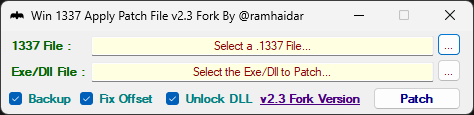

# Win_1337_Apply_Patch

Windows desktop utility for applying text-based `.1337` byte patches to `.exe` and `.dll` files. It provides a Windows Forms GUI for interactive use and a command-line mode for scripted patching.

> **Warning:** Patching executable files changes them in place and can make them unusable. Work on a copy where possible, enable backups before patching, and verify that the patch file belongs to the exact target binary. Use only files you are authorized to modify. Normal startup does not request administrator privileges; protected-file operations require explicit consent.



## Overview

A `.1337` file identifies an expected target filename and one or more byte replacements. Win_1337_Apply_Patch validates the target name and expected bytes before writing the modified binary. After a successful write it removes the PE certificate and recalculates the PE checksum; checksum normalization is skipped only through the internal `skipChecksum` path used by tests.

The assembly version is `2.3.0.0` (`Win_1337_Patch/Properties/AssemblyInfo.cs`), matching the latest tag `v2.3`.

The project is a fork associated with [@ramhaidar](https://github.com/ramhaidar/Win_1337_Apply_Patch) and retains attribution to the original author, DeltaFoX (DeFconX). Two remotes are configured: `origin` points at the `ramhaidar` fork and `upstream` at [Deltafox79/Win_1337_Apply_Patch](https://github.com/Deltafox79/Win_1337_Apply_Patch).

## Features

- Apply `.1337` patches to Windows `.exe` and `.dll` files.
- Validate the patch header, target filename, offsets, hexadecimal bytes, and expected byte values before modifying the target.
- Create timestamped `.BAK` backups before patching.
- Optionally apply the `0xC00` file-offset adjustment used by the GUI and CLI.
- Remove PE certificates and recalculate the PE checksum after a successful write.
- Use a Windows Forms GUI with file dialogs, drag-and-drop patch selection, tooltips, and persisted backup/offset settings.
- Automatically suggest known NVIDIA targets for `nvencodeapi.1337` and `nvencodeapi64.1337` when the expected files exist.
- Patch from the command line with success/error exit codes.
- Request one elevated patch operation without elevating the GUI.
- Explicitly authorize target-only ownership fallback through `takeown` and `icacls` after normal elevated write access fails.
- Explicitly schedule a patch through the current user's Windows `RunOnce` registry entry for execution at the next login.

## Tech Stack

- C# 14 Windows Forms application (`OutputType` is `WinExe`).
- .NET 10 (`net10.0-windows`) for both projects; SDK-style MSBuild (`Microsoft.NET.Sdk`) with default file globbing: `Win_1337_Patch/Win_1337_Patch.csproj` and `Win_1337_Patch.Tests/Win_1337_Patch.Tests.csproj`.
- No direct application NuGet packages: the Windows Desktop framework (`UseWindowsForms`) supplies the `System.Configuration.ConfigurationManager` settings API, and the legacy backport packages (`System.Memory`, `System.Buffers`, `System.Numerics.Vectors`, `System.Runtime.CompilerServices.Unsafe`, `System.Resources.Extensions`) were removed during the migration.
- Test packages: `Microsoft.NET.Test.Sdk` 18.10.1, `MSTest.TestAdapter` 4.4.1, `MSTest.TestFramework` 4.4.1 (VSTest workflow via `dotnet test`).
- PE operations use `Imagehlp.dll` (`ImageRemoveCertificate`); ownership fallback invokes trusted Windows `takeown.exe` and `icacls.exe` directly with separated arguments and checked exit codes.
- The app uses `asInvoker` in `app.manifest` and `vampire.ico` as its application icon. An explicitly approved one-shot child uses Windows UAC (`runas`). Starting the app from an already elevated context still inherits that context.

## Repository Structure

```text
Win_1337_Apply_Patch/
├── Win_1337_Patch.sln             # Application and test solution
├── Win_1337_Patch/
│   ├── 1337.cs                     # Windows Forms UI logic (Form1)
│   ├── Ellipsis.cs                 # Auto-Ellipsis path compaction helper (CodeProject-derived)
│   ├── PatchEngine.cs              # Validation, byte patching, backup, PE normalization
│   ├── PatchTargetResolver.cs      # Known automatic target resolution
│   ├── Program.cs                  # GUI entry point and CLI parser/runner (ConsolePatchParser)
│   ├── ScheduledPatchManager.cs    # Windows RunOnce scheduling and command construction
│   ├── mCheckSum.cs                # PE checksum calculation and fixing
│   ├── app.manifest                # Normal startup inherits invoking privileges
│   ├── app.config                  # Modern user-settings defaults (no Framework startup section)
│   └── Properties/                # Assembly metadata, resources, and user settings
├── Win_1337_Patch.Tests/
│   ├── PatchEngineTests.cs
│   ├── ConsolePatchParserTests.cs  # Also contains ScheduledPatchManagerTests
│   ├── RuntimeCompatibilityTests.cs # .NET 10 migration checks (settings, config, form)
│   ├── PatchTargetResolverTests.cs
│   └── Win_1337_Patch.Tests.csproj
├── docs/screenshots/image.png      # GUI screenshot used above
├── LICENSE                         # GNU GPLv3 text
└── README.md
```

## Prerequisites

### Running the application

- Windows.
- For a **framework-dependent** build or publish output: the [.NET Desktop Runtime 10.0](https://dotnet.microsoft.com/en-us/download/dotnet/10.0) for the matching executable architecture (x64 or x86).
- For a **self-contained** publish output: no separate runtime installation; the .NET runtime is bundled with the application.
- Administrator access only when the selected operation requires it; writable files can be patched without elevation.
- A `.1337` patch file and the matching target `.exe` or `.dll`.

Windows version support follows the official [.NET support policy](https://dotnet.microsoft.com/en-us/platform/support/policy): .NET 10 supports currently in-support Windows versions, and it does not restore compatibility with Windows versions that .NET 10 does not list (the `windows7.0` platform annotation in the source matches the API baseline of the target framework, not a promise that Windows 7 is supported).

### Building and testing

- The exact **.NET SDK 10.0.401**, pinned by `global.json` without SDK roll-forward or preview selection, plus PowerShell 7. The SDK includes MSBuild support for `net10.0-windows` SDK-style projects.
- Visual Studio with the .NET desktop development workload, or the SDK alone — no .NET Framework Developer Pack or targeting pack is required.
- Access to restore the test NuGet packages (`Microsoft.NET.Test.Sdk`, `MSTest.TestAdapter`, `MSTest.TestFramework`).
- A Windows environment for the Windows Forms and Windows API portions of the application.

## Setup

1. Clone the repository and enter its directory:

   ```powershell
   git clone https://github.com/ramhaidar/Win_1337_Apply_Patch.git
   Set-Location Win_1337_Apply_Patch
   ```

2. Restore dependencies:

   ```powershell
   dotnet restore .\Win_1337_Patch.sln --locked-mode
   ```

3. Build the solution in Release configuration:

   ```powershell
   dotnet build .\Win_1337_Patch.sln --configuration Release
   ```

   Alternatively, open `Win_1337_Patch.sln` in Visual Studio and build the `Release | Any CPU` solution configuration.

## Configuration

The application has no required environment variables or external service configuration.

The following user-scoped settings are defined in `Win_1337_Patch/Properties/Settings.settings`:

| Setting | Effect |
|---|---|
| `fixoffset` | Enables the `0xC00` file-offset adjustment by default. |
| `backup` | Enables timestamped target backups by default. |
| `changeOwnership` | Default is `False`; the GUI always starts unchecked and never restores saved ownership consent. |

Backup and offset choices are persisted through the normal .NET user-settings mechanism (`Properties.Settings.Default.Save()`), with defaults mirrored in `Win_1337_Patch/app.config` using modern `System.Configuration.ConfigurationManager` sections. Ownership authorization is per-operation, is reset after completion or target selection, and is not saved. Form initialization does not save preferences. No secrets are stored in the repository. Do not commit target binaries, private patch files, backups, or generated build output.

> **Note (post-migration):** Settings keys remain stable, but the .NET 10 runtime can store `user.config` in a different location than the previous .NET Framework 4.8 build. Framework preferences are **not** imported automatically. Regardless of saved preferences, ownership consent is never restored.

### Regenerating settings without Visual Studio

PowerShell 7 can regenerate `Properties/Settings.Designer.cs` from `Settings.settings` without an IDE or external packages:

```powershell
pwsh -NoProfile -File .\scripts\Generate-Settings.ps1
pwsh -NoProfile -File .\scripts\Generate-Settings.ps1 -Check
pwsh -NoProfile -File .\scripts\Test-SettingsGenerator.ps1
```

Edit the source `.settings` file, not generated C# metadata. The generator supports this project's Boolean user-scoped settings and rejects unsupported types, profiles, invalid names, and defaults before writing. `-Check` fails on stale or missing output without modifying it; ordinary builds do not regenerate files. Output is deterministic UTF-8, with checkout line-ending conversion accepted by the check. Visual Studio's custom tool remains available, but its formatting differs: rerun this script before using the script's consistency check.

## Usage

### GUI

1. Launch the built `Win_1337_Patch.exe` normally.
2. Select a `.1337` file, drag it onto the patch-file box, or double-click the patch-file box to open the dialog.
3. Select the target `.exe` or `.dll`. The application may auto-select a known NVIDIA target; otherwise use **Select EXE** to choose the file manually.
4. Review the options:
   - **Fix File Offset**: subtract `0xC00` from each patch offset before applying it.
   - **Create Backup**: create a timestamped, uniquely named `<target>.<timestamp>.<id>.BAK` copy before writing.
   - **Ownership**: advanced fallback requiring confirmation for this target; used only after ordinary elevated write access fails. It changes ownership/permissions persistently and does not bypass file locks.
5. Click **Patch** and review the result. If normal access is denied before writing, explicitly approve a one-shot administrator operation and the Windows UAC prompt; the GUI remains unelevated.

### Command line

The executable supports patch mode with this form:

```text
Win_1337_Patch.exe -patch <1337-file> <target-file> [options]
```

The executable is built as a Windows GUI application, so command-line mode allocates a console (`AllocConsole`) for output. The process returns exit code `0` on success and `1` on validation, scheduling, or patching failure.

#### Options

| Option | Description |
|---|---|
| `-patch`, `--patch` | Select command-line patch mode. |
| `-fileoffset`, `--fileoffset`, `-offset`, `--offset` | Apply the `0xC00` offset adjustment. |
| `-backup`, `--backup`, `-b` | Create a timestamped backup before patching. |
| `-elevate`, `--elevate` | Permit one UAC administrator operation only if ordinary access fails before mutation. Without this flag, scripted invocations fail rather than unexpectedly prompt. |
| `-takeownership`, `--takeownership`, `-take-ownership`, `--take-ownership` | Authorize target-only ownership fallback after normal elevated write access fails. Does not authorize elevation itself: also use `-elevate` or an administrator context. |
| `-schedule`, `--schedule`, `-runonce`, `--run-once`, `-run-on-reboot`, `--run-on-reboot` | Store an explicitly requested command in the invoking user's `RunOnce` registry key for next login; preserve elevation only when explicitly selected. |
| `-h`, `--help`, `/?`, `/help` | Display usage information. |

Bare `-help` is not a supported alias; use `-h` or `--help`.

Examples:

```powershell
# Apply a patch
.\Win_1337_Patch.exe -patch .\patch.1337 .\target.dll

# Apply a patch and keep a backup
.\Win_1337_Patch.exe -patch .\patch.1337 .\target.dll -backup

# Apply a patch with the 0xC00 adjustment
.\Win_1337_Patch.exe -patch .\patch.1337 .\target.dll -fileoffset

# Allow a one-shot administrator operation for an authorized protected target
.\Win_1337_Patch.exe -patch .\patch.1337 .\target.dll -elevate -backup

# Explicitly allow ownership fallback only if ordinary elevated access fails
.\Win_1337_Patch.exe -patch .\patch.1337 .\target.dll -elevate -takeownership -backup

# Schedule the patch for next login (no implicit elevation or ownership)
.\Win_1337_Patch.exe -patch .\patch.1337 .\target.dll -schedule -backup
```

The `-scheduledrun` / `--scheduled-run` switch is an internal marker added to commands created by the scheduler. It is not normally needed for manual invocation.
The `-elevatedworker` / `--elevated-worker` marker routes an approved one-shot child; it does not grant privileges, bypass validation, or permit scheduling. An unelevated worker is rejected.

### Automatic target resolution

The GUI resolves these patch filenames, when the candidate target exists:

| Patch file | Suggested target |
|---|---|
| `nvencodeapi.1337` | `%WINDIR%\SysWOW64\nvEncodeAPI.dll` |
| `nvencodeapi64.1337` | `%WINDIR%\System32\nvEncodeAPI64.dll` |

Automatic resolution is limited to these names. Other patch files require manual target selection.

## `.1337` File Format

The patch engine expects a text file whose first line starts with `>` and whose remaining non-empty lines contain hexadecimal byte replacements:

```text
>target.exe
1A3F:90->EB
1A40:00->90
```

- The header is `>` followed by the expected target filename. The comparison uses the filename, not the full path, and is case-insensitive.
- Each patch entry is `offset:expected->replacement`.
- Offsets and bytes are hexadecimal; the offset is parsed as a 32-bit hex integer.
- The expected byte must match the target at the computed offset; otherwise the patch fails before the target is written.
- With **Fix File Offset** enabled, the engine subtracts `0xC00` from every declared offset.
- Blank lines after the header are ignored.

## Architecture

- **`PatchEngine`** is shared by the GUI and CLI. It resolves paths, validates files and patch entries, checks expected bytes, optionally grants ownership, optionally creates a backup, writes the modified bytes, removes the PE certificate, and recalculates the checksum.
- **`PatchElevationCoordinator` / `ElevatedPatchLauncher`** distinguish eligible pre-write permission failures and launch one explicitly authorized UAC child. The child rereads current files, revalidates expected bytes, and exits; the parent waits for its exit status.
- **`PatchFileOperations` / `FileOwnershipService`** isolate file/PE access and direct Windows utility execution. The target is revalidated on the exclusive writable stream; target ownership is never changed to fix unreadable files, backup-directory permissions, invalid patches, or sharing violations.
- **`Program`** chooses CLI mode when `-patch`/`--patch` is present; otherwise it starts the Windows Forms application. The nested `ConsolePatchParser` handles CLI switches and positional paths.
- **`PatchTargetResolver`** contains the known NVIDIA filename-to-target mappings used by the GUI.
- **`ScheduledPatchManager`** validates paths and writes a generated command to `HKCU\SOFTWARE\Microsoft\Windows\CurrentVersion\RunOnce`, with an entry name of the form `Win_1337_Patch_<timestamp>_<guid>`. The command runs the application with `-scheduledrun` after the next boot/login cycle.
- **`mCheckSum`** performs PE checksum recalculation (`FixCheckSum`) after patching.
- **`Ellipsis`** compacts long paths for display in the form's text boxes.

`Win_1337_Patch/Properties/AssemblyInfo.cs` declares `InternalsVisibleTo("Win_1337_Patch.Tests")`, which is how the MSTest project exercises the internal `ConsolePatchParser`, `PatchScheduleDescriptor`, `ScheduledPatchManager`, and the internal `skipChecksum` constructor.

## Common Commands

Run these from the repository root in PowerShell:

| Task | Command | Status |
|---|---|---|
| Restore | `dotnet restore .\Win_1337_Patch.sln --locked-mode` | Verifies committed dependency locks on SDK 10.0.401 |
| Build Debug | `dotnet build .\Win_1337_Patch.sln --configuration Debug` | Supported with the .NET 10 SDK; no targeting pack needed |
| Build Release | `dotnet build .\Win_1337_Patch.sln --configuration Release` | Verified working; builds clean with 0 warnings/errors on .NET SDK 10.0.401 |
| Run all tests | `dotnet test .\Win_1337_Patch.Tests\Win_1337_Patch.Tests.csproj --configuration Release` | Windows required; 77 tests passed in the least-privilege verification |
| Run focused tests | `dotnet test .\Win_1337_Patch.Tests\Win_1337_Patch.Tests.csproj --filter "FullyQualifiedName~PatchEngineTests"` | Supported by the MSTest test runner |
| Verify CI/release inputs | `pwsh -NoProfile -File .\scripts\Verify-Build.ps1` | Locked restore, settings/release/workflow fixtures, clean Release build and full MSTest suite |
| Compare local rebuilds | `pwsh -NoProfile -File .\scripts\Test-ReproducibleRelease.ps1` | Two disposable source roots; compares all extracted files and both ZIPs without launching the app |
| Lint | — | No lint command/configuration was found in the repository |
| Format | — | No formatter command/configuration was found in the repository |
| Typecheck | — | No separate typecheck command was found; compilation is the available C# check |

Visual Studio users can run the full suite through **Test > Run All Tests**.

## Testing

Tests are in `Win_1337_Patch.Tests` and use MSTest (`Microsoft.NET.Test.Sdk` 18.10.1, `MSTest.TestAdapter` 4.4.1, and `MSTest.TestFramework` 4.4.1, run through the VSTest-based `dotnet test` workflow). Test classes use `[TestClass]` with `[TestMethod]` methods, plus `[STATestMethod]` for STA form tests.

- `PatchEngineTests` - patch application, backup creation (including verifying backup contents), header validation, target-name validation, and expected-byte mismatch handling. These use `[TestInitialize]`/`[TestCleanup]` with per-test temporary directories and the internal `skipChecksum: true` path to avoid PE normalization on fake files.
- `ConsolePatchParserTests` - CLI elevation/worker/scheduling flags and routing without implicit elevation or rescheduling.
- `ScheduledPatchManagerTests` - scheduled command-line construction (defined inside `ConsolePatchParserTests.cs`).
- `PatchTargetResolverTests` - known and unknown automatic target resolution, and empty-path handling.
- `RuntimeCompatibilityTests` - modern settings/config sections, safe defaults, `asInvoker` manifest, original form resources/layout, and per-operation GUI consent with test-only UI message processing.
- `FileOwnershipServiceTests` - trusted utility paths, literal arguments, failure handling, and partial-permission warnings without running ownership utilities.
- `PatchElevationCoordinatorTests` / `ElevatedPatchLauncherTests` - explicit elevation decisions, cancellation, child status, no-relaunch/no-post-write-retry rules, and Windows argument quoting without real UAC prompts.

Run the test project on Windows with the .NET 10 SDK and restored test packages. Tests use synthetic temporary files, an `InternalsVisibleTo` internal bypass, and a copy of the application `app.config` as a read-only fixture; they never write the real user settings, show a window, or touch real system files.

Coverage verifies settings metadata/config, embedded resources, consent decisions, command construction, and patch-engine logic — not real UAC integration, ownership manipulation, cross-launch persistence, real PE rewriting of system files, visual high-DPI rendering, or login-scheduled execution. The suite must pass before release. The separate PowerShell generator tests use temporary files only; they do not touch application preferences.

## Development Notes

- The application targets `AnyCPU` and uses the `Debug` and `Release` configurations defined in the solution.
- The manifest uses `asInvoker`; protected operations elevate only with explicit permission. No normal startup or patch operation writes RunOnce.
- Patch files are validated against the current target bytes. Do not reuse a patch against a different binary revision without confirming its expected bytes.
- Backups are created only when the backup option is enabled. A backup failure prevents the patch from proceeding; if no backup was requested, the target is written without a backup copy.
- Ownership fallback runs `takeown /F <file>` and `icacls <file> /grant *S-1-5-32-544:F` directly for one validated target. Nonzero utility exit codes stop patching; partial permissions changes are reported.
- Any failure after writing may have begun or during PE normalization reports a potentially changed target and available backup. No automatic elevation/retry occurs; inspect or restore the target first.
- A scheduled patch writes a `RunOnce` value under the current user's registry hive. Inspect or remove that entry through normal Windows registry administration if a scheduled operation must be cancelled.
- Tests must run on Windows: the application references Windows Forms, `Imagehlp.dll`, and the registry.
- Settings code generation is an explicit PowerShell developer command. Windows CI and manual draft-release workflows are defined under `.github/workflows/`; there are no repository-defined migrations or seed steps.

## Deployment

Windows CI verifies branch pushes and pull requests with read-only permissions. The separate release workflow runs **only manually** and creates a **draft**, not a published release. No installer project or container configuration is provided. A normal Release build produces `Win_1337_Patch/bin/Release/net10.0-windows/Win_1337_Patch.exe`.

### Manual tagged draft releases

Once the workflow is present on the repository's default branch, open **Actions → Manual tagged draft release → Run workflow** and supply an **existing tag containing this pipeline and its lock files**. Selecting a workflow branch does not select the application source: the tag input is independently resolved to its exact commit SHA. Older tags lacking this configuration fail without falling back to another branch. Normal commits/tag pushes never create releases.

The workflow verifies/builds that SHA on Windows with SDK `10.0.401`, pins the release runtime to `10.0.12`, and retains:

- `Win_1337_Patch-<tag>-win-x64-framework-dependent.zip` — requires x64 .NET Desktop Runtime **10.0.12 or a compatible newer patch**.
- `Win_1337_Patch-<tag>-win-x64-self-contained.zip` — bundles runtime `10.0.12`.
- `SHA256SUMS` — SHA-256 for both ZIPs, not MD5.
- `provenance.json` — source tag/SHA, workflow ref/SHA, run URL, toolchain, runtime modes and ZIP hashes.

The draft job downloads and uploads **the same verified ZIP bytes**, without rebuilding or executing downloaded code. Only that job has release-write permission; it rejects moved/missing tags, existing drafts/releases, unexpected files and mismatched hashes/provenance. Failed uploads can leave a partial draft: inspect it manually rather than rerunning to overwrite assets. Review the run, provenance and assets before manually publishing the draft. The package tag does **not** change the handwritten assembly version, currently `2.3.0.0`.

### Rebuild and verify integrity

Use a separate clean checkout of an existing tag that contains this pipeline. Substitute the release's exact tag; these commands do not create a tag or publish anything:

```powershell
$tag = 'REPLACE-WITH-EXISTING-RELEASE-TAG'
git clone https://github.com/ramhaidar/Win_1337_Apply_Patch.git patcher-rebuild
Set-Location patcher-rebuild
git show-ref --verify "refs/tags/$tag"
if ($LASTEXITCODE -ne 0) { throw 'Exact tag is missing.' }
$sha = (git rev-parse --verify "refs/tags/$tag^{commit}").Trim()
if ($LASTEXITCODE -ne 0) { throw 'Tag does not resolve to a commit.' }
git switch --detach $sha
if ($LASTEXITCODE -ne 0) { throw 'Checkout failed.' }
$time = (git show -s --format=%cI $sha).Trim()
pwsh -NoProfile -File scripts/Build-Release.ps1 -Tag $tag -SourceCommit $sha -CommitTimeUtc $time -OutputDirectory artifacts/rebuilt
if ($LASTEXITCODE -ne 0) { throw 'Rebuild failed.' }
```

Install exact SDK `10.0.401` and PowerShell 7 before building. The output directory must not already exist. Locked restores validate dependencies; runtime/apphost packs are selected by explicit release properties, not by the app's otherwise empty dependency lock. Both ZIPs include the complete publish output, original GPLv3 LICENSE and fixed source/toolchain attribution. ZIP entry order and UTC timestamps are normalized from the source commit.

For downloaded assets, first obtain `SHA256SUMS` and `provenance.json` from the trusted release/run, then verify both ZIPs (run from their directory):

```powershell
Import-Module /path/to/trusted-checkout/scripts/ReleaseArtifacts.psm1
Test-ReleaseHashes -Directory $PWD.Path -AssetNames (Get-ReleaseAssetNames $tag)
Get-FileHash -LiteralPath "Win_1337_Patch-$tag-win-x64-framework-dependent.zip" -Algorithm SHA256
```

Do not load scripts from untrusted downloaded artifacts. The integrity check requires exactly the two expected ZIPs, `SHA256SUMS` and `provenance.json` in that directory. Match the recorded source SHA to the tag and inspect the linked build run. A trusted checksum detects changed bytes; it is **not an Authenticode signature**, antivirus guarantee or proof of reproducibility. The binaries remain unsigned and GitHub cryptographic artifact attestations are not implemented.

See [release signing and antivirus false-positive review](docs/RELEASE-SECURITY.md) for open-source signing eligibility, official Microsoft/vendor submission steps, and a **not-posted** #901 tracking draft. This is documentation only: no signing enrollment, vendor submission or issue-state change has occurred.

Local verification on Windows produced identical ZIPs and **282 extracted files** across two clean temporary source roots using the same current source snapshot/toolchain. Run `scripts/Test-ReproducibleRelease.ps1` to repeat that experiment; it explicitly labels uncommitted source as `local-snapshot`. This is not proof of cross-machine equality, a successful official rebuild from a new tag, or a completed hosted workflow. No hosted dispatch/release has been performed in this implementation; local policy/fake-API tests passed, but `actionlint` was unavailable and hosted acceptance remains pending.

### Updating pinned inputs

Update SDK `global.json`, runtime/release properties in `Directory.Build.props`, and their corresponding script/workflow assertions and provenance fields together. Regenerate ordinary locks with `dotnet restore Win_1337_Patch.sln --use-lock-file --force-evaluate`; regenerate both app mode locks with the same command on the app project plus `-p:ReleaseBuild=true -p:ReleaseMode=framework-dependent` or `self-contained`. Inspect actual runtime/apphost versions, rerun locked verification and the two-root comparison, and review updated official action SHAs/metadata before releasing. Self-contained security updates require republishing; pins must never silently float.

### Publishing

The project supports directory-based `dotnet publish` in framework-dependent and self-contained modes. Verified examples (all completed with exit code 0 and no warnings during the migration verification):

```powershell
# Framework-dependent: requires the .NET Desktop Runtime 10.0 (x64) on the target machine
dotnet publish .\Win_1337_Patch\Win_1337_Patch.csproj --configuration Release --runtime win-x64 --self-contained false --output .\Win_1337_Patch\bin\publish\win-x64-framework-dependent

# Self-contained: bundles the .NET runtime; no separate runtime install needed, but the output is much larger
dotnet publish .\Win_1337_Patch\Win_1337_Patch.csproj --configuration Release --runtime win-x64 --self-contained true --output .\Win_1337_Patch\bin\publish\win-x64-self-contained
```

The 32-bit alternative (`--runtime win-x86`, with either `--self-contained` value) was verified the same way during the migration; use it only for 32-bit scenarios.

Publishing notes:

- Distribute the **complete published directory**, not just the `Win_1337_Patch.exe`. The `.dll`, `.deps.json`, `.runtimeconfig.json`, and `.dll.config` files next to it are required at runtime.
- A framework-dependent output requires the .NET Desktop Runtime 10.0 installed **for the matching architecture** (an x64 build needs the x64 runtime, x86 needs the x86 runtime).
- A self-contained output bundles the runtime and needs no .NET installation, but it is significantly larger and must be **republished** to pick up .NET runtime security updates.
- The published `.exe` is the native apphost; it carries the `asInvoker` manifest, application icon and version `2.3.0.0` resources. Use the manual tagged pipeline above for official release ZIPs; raw publish examples are developer outputs, not equivalent provenance guarantees. [Signing/vendor-submission guidance](docs/RELEASE-SECURITY.md) is documentation, not completed external signing or vendor approval.
- No trimming, Native AOT, single-file packaging, or ReadyToRun options are used or supported by this repository's configuration.

## Troubleshooting

### The patch is rejected as invalid

Confirm that the first line is a `>` header and that the filename after `>` matches the target filename. The comparison ignores case but does not ignore a different filename.

### The expected byte does not match

The patch is for a different binary revision, the target was already modified, or the offset mode is wrong. Restore a known-good backup and verify whether the patch requires **Fix File Offset** before trying again.

### A protected file cannot be changed

First permit a one-shot administrator operation (GUI confirmation or CLI `-elevate`). Use **Ownership** / `-takeownership` only when appropriate and explicitly authorized; it is attempted only after normal elevated write access fails. File locks and invalid patch data do not trigger ownership changes. If an elevated target cannot be read and validated, the operation fails without changing ownership.

### A scheduled patch does not run

Scheduling uses the invoking user's `HKCU` `RunOnce` entry at next login, not unattended boot. Confirm paths still exist. Protected targets need explicit `-elevate` recorded when scheduling and interactive UAC approval at execution; the marker cannot bypass UAC. Cancelled or failed execution is not automatically rescheduled.

### The build reports an unknown target framework or missing SDK

The projects target `net10.0-windows` and `global.json` requires exact **SDK 10.0.401**. Verify with `dotnet --list-sdks`; a different installed SDK does not satisfy the pin. No .NET Framework Developer Pack or targeting pack is needed.

### A framework-dependent build does not start on another machine

A framework-dependent build or publish requires the **.NET Desktop Runtime 10.0 for the matching architecture** (x64 vs x86) on the target machine. If the runtime is missing or the architecture does not match, the apphost fails to start. Either install the matching Desktop Runtime or use a self-contained publish, which bundles the runtime.

## Contributing

1. Create a focused branch for your change.
2. Keep changes limited to the requested behavior and preserve the SDK-style project structure, the shared `PatchEngine` design, and the .NET 10 target.
3. Add or update MSTest coverage for patch validation, CLI parsing, target resolution, scheduling, or runtime-compatibility changes.
4. Run the solution build and the relevant test project with the .NET 10 SDK before opening a pull request.
5. Do not include target binaries, private patch files, backups, `bin`/`obj`/publish output, or user-specific settings in commits.

No separate `CONTRIBUTING.md` was found. For issues and pull requests, use the repository's [GitHub project](https://github.com/ramhaidar/Win_1337_Apply_Patch).

## License

This project is licensed under the [GNU General Public License v3.0](LICENSE). The repository also contains attribution to the original author, DeltaFoX (DeFconX).
